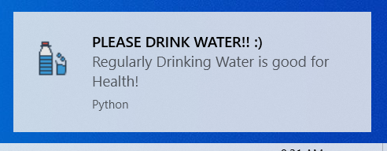

# Python-Notifications
This program generates a windows notification for reminding us to drink water every hour


## Requirements
```
pip install plyer
```
## Running the program in background
Use the following command in cmd
```
pythonw notification.py
```
The program will keep running in the background serving notifications every hour

## Killing the program execution
Kill the program running in the background using cmd
1) Find the task
```
tasklist
```
2) Find "pythonw" and kill the task forcefully
```
taskkill /F /PID <PID number>
```